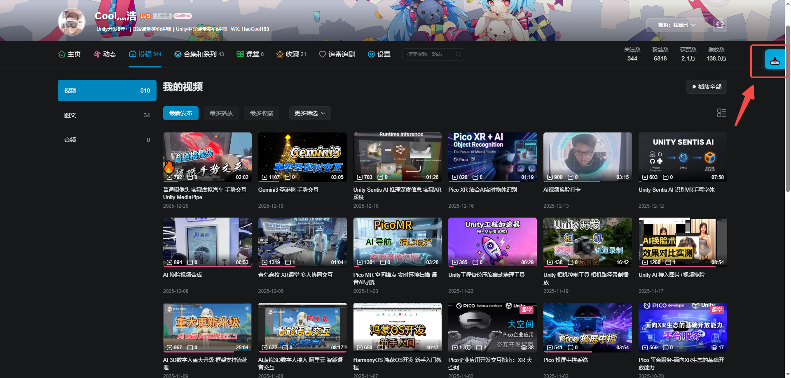
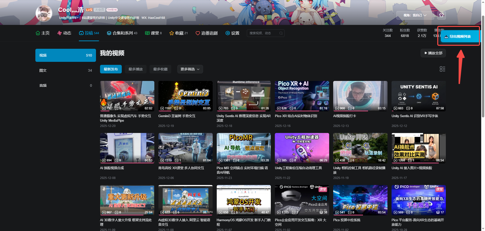

# Bilibili Video Exporter

[简体中文](README.md) | [English](README.en.md)

Export any Bilibili creator's video list to CSV with one click. Supports title, cover, views, duration, publish time, and more.

[Features](#features) · [Install](#install) · [Quick Start](#quick-start) · [Fields](#export-fields) · [Docs](docs/USAGE.md) · [FAQ](docs/FAQ.md)

---

## Preview

## Features

- ✅ **One-click export**: Button or hotkey to export the current page
- 🗂️ **Complete data**: Index, title, BV id, link, cover, duration, views, publish time
- ⌨️ **Hotkey**: `Ctrl+Shift+E` to trigger quickly
- 🧊 **Non-intrusive UI**: Floating sidebar button, expands on hover
- 📄 **CSV output**: Opens directly in Excel/WPS
- 🔒 **Client-side only**: Pure frontend, no data upload
- 🛰️ **CSP-safe**: Uses Data URI to avoid download blocks

## Install

### Option 1: Tampermonkey (recommended)

1. Install Tampermonkey extension  
   - [Chrome/Edge](https://chrome.google.com/webstore/detail/tampermonkey/dhdgffkkebhmkfjojejmpbldmpobfkfo)  
   - [Firefox](https://addons.mozilla.org/firefox/addon/tampermonkey/)
2. Install script  
   - Click [Install script](src/bilibili_video_exporter.user.js)  
   - Or copy `src/bilibili_video_exporter.user.js` into Tampermonkey

### Option 2: Browser console

1. Open the creator's video page on Bilibili and press `F12`
2. Switch to `Console`, paste the code from `src/bilibili_export_console.js`, and hit Enter

See [usage doc](docs/USAGE.md) for details.

## Quick Start

1. Open the creator homepage and click the "投稿" tab
2. Wait for the video list to load
3. Click the 📥 button on the right or press `Ctrl+Shift+E`
4. CSV will download automatically when export finishes

> Tip: The list is lazy-loaded. Scroll down to load all videos before exporting if you want the full list.

## Export Fields

| Field      | Description            | Example                                       |
|------------|------------------------|-----------------------------------------------|
| Index      | Video index            | 1                                             |
| Title      | Video title            | How to use the exporter                       |
| BV         | Unique video id        | BV1xx411c7mD                                  |
| Link       | Full video URL         | https://www.bilibili.com/video/BV1xx411c7mD   |
| Cover      | Cover image URL        | https://i0.hdslb.com/...                     |
| Duration   | Video duration         | 10:23                                         |
| Views      | Play count             | 12k                                           |
| Published  | Publish date           | 2025-01-02                                    |

## Docs

- [Usage](docs/USAGE.md)
- [FAQ](docs/FAQ.md)
- [Changelog](CHANGELOG.md)
- [Contributing](CONTRIBUTING.md)

## Contributing

Issues and PRs are welcome!

## Author

**Cool灬浩**

- Bilibili: [https://space.bilibili.com/228962838](https://space.bilibili.com/228962838)
- GitHub: [@Cool灬浩](https://github.com/your-username)

## License

MIT, see [LICENSE](LICENSE).

## Disclaimer

For learning and communication only; do not use for commercial purposes. Use at your own risk.

## Support the project

If this tool helps you, you can buy the author a milk tea:

If you like this project, a ⭐ Star is appreciated!

