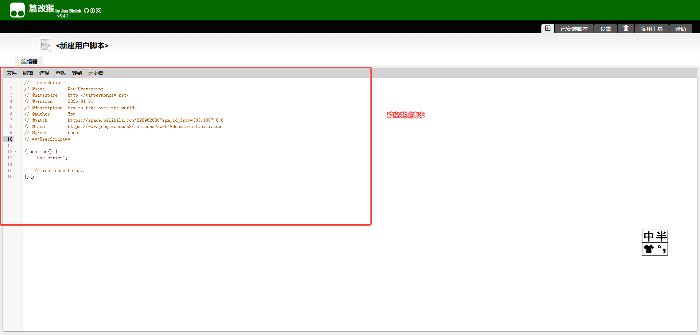
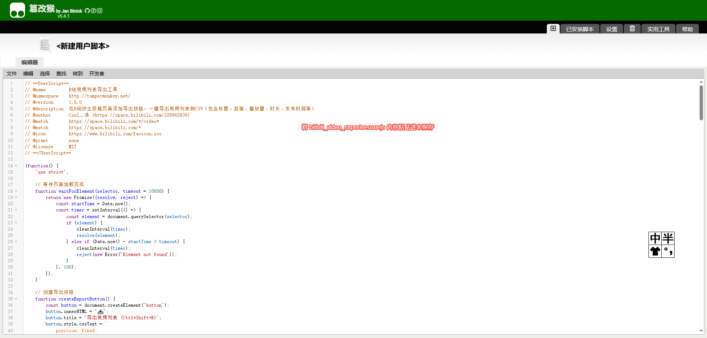
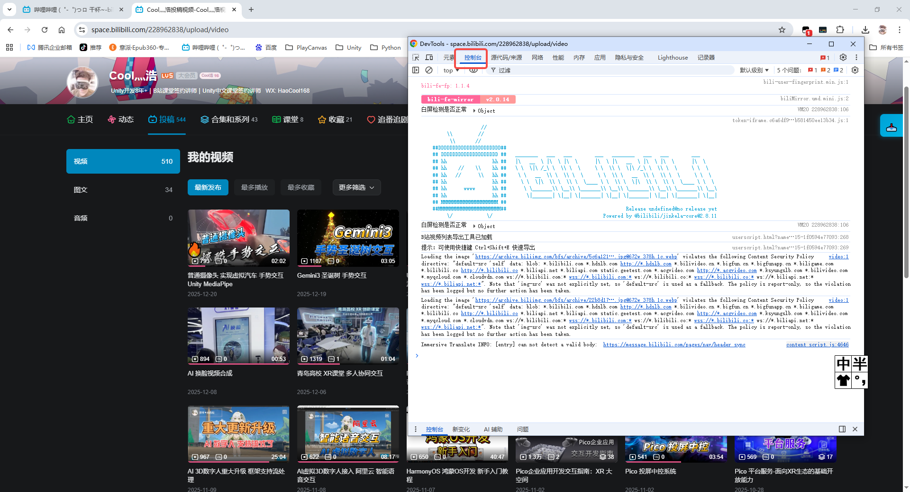
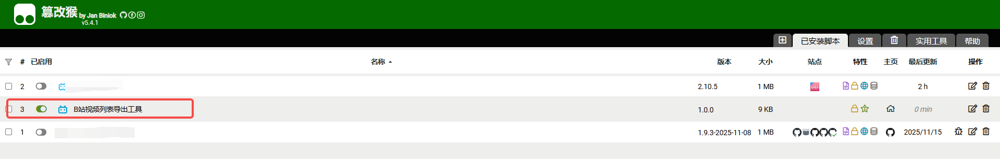
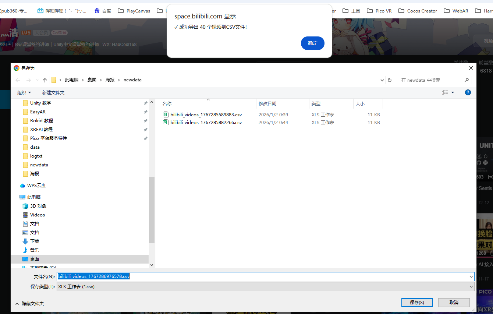
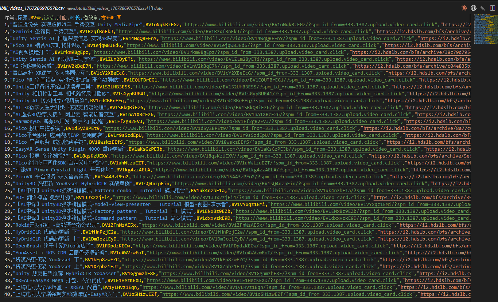
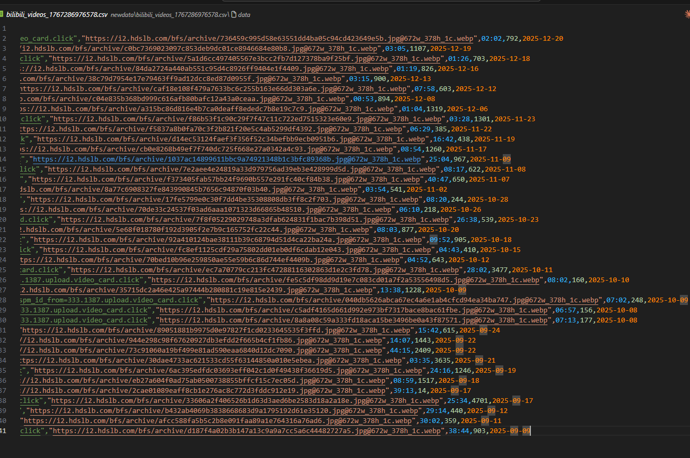

# 📖 图文使用教程

本教程将通过详细的图文说明，帮助你快速上手B站视频列表导出工具。

---

## 📦 安装教程

### 步骤1：打开Tampermonkey管理面板

点击浏览器工具栏的Tampermonkey图标，选择"管理面板"。


### 步骤2：创建新脚本

在管理面板中，点击左侧的"+"号（添加新脚本）按钮。

### 步骤3：清空默认内容

Tampermonkey会打开一个编辑器，里面有默认的模板代码。



**操作：** 按 `Ctrl+A` 全选，然后按 `Delete` 删除所有内容。

### 步骤4：粘贴工具脚本

复制 `src/bilibili_video_exporter.user.js` 文件的全部内容，粘贴到编辑器中。



**操作：** 按 `Ctrl+S` 保存脚本。

---

## 🖥️ 控制台使用方法（临时使用）

如果你不想安装Tampermonkey，可以使用控制台方式临时运行脚本。

### 步骤1：打开控制台

在B站UP主投稿页面，按 `F12` 键打开开发者工具。



### 步骤2：切换到Console标签

点击顶部的"Console"（控制台）标签。

### 步骤3：粘贴脚本代码

1. 打开 `src/bilibili_export_console.js` 文件
2. 复制全部内容
3. 粘贴到控制台
4. 按 `Enter` 键运行

⚠️ **重要提示：浏览器安全警告**

首次在控制台粘贴代码时，浏览器可能会显示安全警告，阻止粘贴操作：

```
警告：请勿粘贴您不理解的代码
如果您确定要粘贴，请输入 "allow pasting" 并回车
```

**解决方法：**
1. 按照提示，在控制台输入 `allow pasting`（或浏览器提示的其他内容）
2. 按 `Enter` 键
3. 现在可以正常粘贴脚本代码了
4. 再次粘贴脚本代码并按 `Enter` 运行

**为什么会有这个提示？**
- 这是浏览器的安全保护机制
- 防止恶意代码通过控制台执行
- 本工具代码完全开源，可以放心使用

### 步骤4：等待导出完成

脚本会自动：
- 提取页面上的视频信息
- 生成CSV文件
- 自动下载

**注意：** 控制台方式每次使用都需要重新粘贴代码。

---

## 🚀 使用教程（Tampermonkey方式）

### 步骤1：访问B站UP主投稿页面

打开任意B站UP主的主页，点击"投稿"标签。


### 步骤2：开启工具

确保Tampermonkey已启用，脚本会自动加载。右侧会出现 📥 图标。



**提示：** 如果没有看到图标，请刷新页面。

### 步骤3：刷新网页保证工具开启

如果第一次访问，建议刷新一次页面，确保脚本正常加载。


**检查方法：**
- 按 `F12` 打开控制台
- 查看是否有"B站视频列表导出工具已加载"的提示

### 步骤4：点击导出按钮

鼠标移到右侧边缘，📥 图标会展开显示"导出视频列表"。


**操作方式：**
- **方式1：** 点击展开的按钮
- **方式2：** 按快捷键 `Ctrl+Shift+E`

### 步骤5：确认导出成功

点击后会弹出提示框，显示导出的视频数量。



**提示信息：** "✓ 成功导出 XX 个视频到CSV文件！"

---

## 📊 查看导出结果

### CSV文件位置

导出的CSV文件会自动下载到浏览器的默认下载目录。



**文件命名格式：** `bilibili_videos_时间戳.csv`

### 用Excel打开

双击CSV文件，用Excel或WPS打开查看数据。



**包含的字段：**
- 序号
- 标题
- BV号
- 链接
- 封面URL
- 时长
- 播放量
- 发布时间

---

## 💡 使用技巧

### 导出更多视频

B站使用懒加载机制，默认只显示部分视频。要导出所有视频：

1. **向下滚动页面** - 加载更多视频
2. **等待加载完成** - 看到"没有更多了"提示
3. **再次点击导出** - 导出所有已加载的视频

### 快捷键使用

按 `Ctrl+Shift+E` 可以快速触发导出，无需点击按钮。

### 批量导出

如需导出多个UP主的视频：
1. 导出第一个UP主
2. 访问第二个UP主的投稿页面
3. 重复导出操作
4. 每个UP主会生成独立的CSV文件

---

## ❓ 常见问题

### Q: 为什么只导出了部分视频？

**A:** 需要滚动页面加载所有视频后再导出。

### Q: CSV文件乱码怎么办？

**A:** 使用Excel 2016+直接打开，或在导入时选择UTF-8编码。

### Q: 找不到导出按钮？

**A:**
1. 确认在UP主的投稿页面（URL包含`/video`）
2. 刷新页面
3. 检查Tampermonkey是否启用

---

## 🎯 下一步

- 查看 [完整文档](USAGE.md) 了解更多功能
- 遇到问题？查看 [FAQ](FAQ.md)
- 想要贡献？查看 [贡献指南](../CONTRIBUTING.md)

---

**教程版本：** 1.0.0
**最后更新：** 2026-01-02
**作者：** Cool灬浩 ([B站主页](https://space.bilibili.com/228962838))
